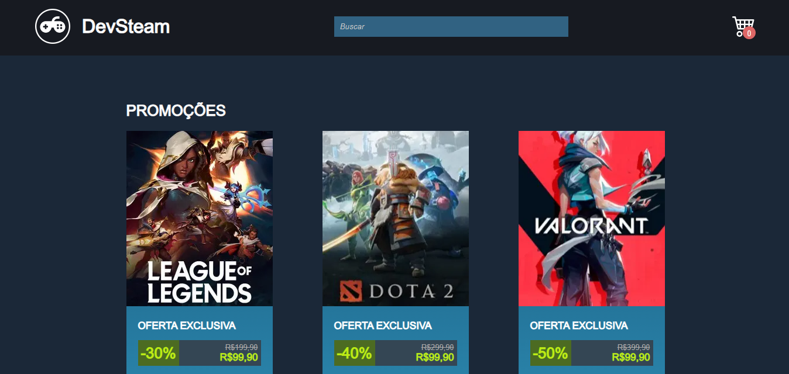

## 📝Descrição

Esse projeto foi construído para fins didáticos no evento Semana da Evolução na Programação.




## 🚀Tecnologias

- NextJs na sua versão 13.4.1
- ReactJs na versão 18.2.0

## Comandos

Para instalar as bibliotecas e dependências:

```bash
npm i
```

Para rodar o projeto:

```bash
npm run dev
```

Depois, é só abrir [http://localhost:3000](http://localhost:3000) com o seu navegador.


